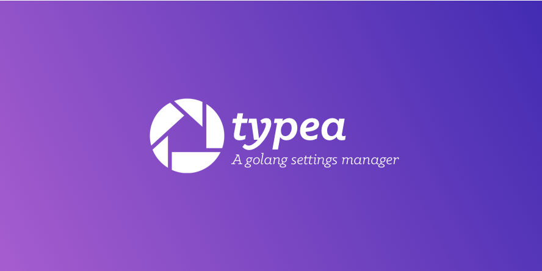

 

[](https://github.com/sotownsend/plumbus/blob/master/LICENSE)

# What is this?

In many development projects, you may have a library or program that runs in a server environment that takes a configuration bundle.
When this configuration stage fails it can cause many hard to identify bugs. This package is designed to make settings more opaquely
visibly so that you can catch misconfiguration errors early on.

This settings manager package does not actually retrieve or set settings; that is entirely up to you how you would like to receive
settings (e.g. environmental variables, yaml, etc.).  This manager only manages settings once they have been received and provides
some functions to directly insert settings inline as well.

### Example scenerio
For example, let's say we have a backing store named `Sql` and we have created an associated custom DSL represented by the `Sqltypea` object in our library:

```go
// Get our Sqltypea object
myQuery := NewSqltypea()

// Now add our queries
myQuery.WhereIdIs(4)
myQuery.AndCreatedAfter(time.Time(100, 0))

// typea looks up what `Apply` function to use because 
// you set a `QueryRunner` on creation of your custom `typea`.
//
// This function is called many times like a map-reduce
myQuery.Apply(func (entry interface{})) {
}
```

In this example, the `Sql` is a library owned object.  `Sql` has been extended to include a function called `NewQuery()` which returns a `Sqltypea` instance.

## Usage

### Step 1

First, you will need to create a `struct` to represent your custom query-builder and a custom record to store the results (`SqlQueryRecord`).  This should include the `typea` embed.

```go
type Sqltypea struct {
  typea
}

// A record which will represent a query object
type SqlQueryRecord struct {
  Type string
  CreatedAfter time.Time
}

// Define our 'runner' which will actually interpret and execute the query.
var sqltypeaRunner = func (queries []interface{}) (res []interface{}, err error) {
    sql := GetSql()
    
    // Because the hypothetical sql interface is also fluent
    // not much has to be done here.
    for _, _q := range queryObjects {
	 switch q := _q.(type) {
	   case WithTypeQuery:
	     sql = sql.Where("type = ?", q.type)
	   case CreatedAfter:
	     sql = sql.Where("created_after > ?", q.CreatedAfter.Unix())      
	   default:
	     panic("Unsupported query type '%T'", Q)
	  }
  }
  
  _res := []SqlQueryRecord{}
  err := sql.Find(&_res)
  if err != nil {
    return nil, err
  }
  
  return _res, nil
}

func NewSqltypea() *Sqltypea {
  qb := &Sqltypea{}
  
  // Initialize our embedded `typea` object.  The first parameter is the
  // runer.
  qb.Init(sqltypeaRunner)
}
```

### Step 2

Now we need to add some actual queries to our query builder.  Usually, you would do this via a mixin from an external import, but for this example, we're going to create our own mixin.

> A typea **mixin** automatically provides you with a set of queries.

```go
// The mixin which adds `WithType`
type TypeMixin struct {
  // Provides qb and Init()
  QueryMixin
}

// The object that stores the query information
type WithTypeQuery struct {
  Type string
}

// The query we've added
func (t *TypeMixin) WithType(type string) {
  t.Push(WithTypeQuery{
    Type: type
  })
}
```

### Step 3
Now, we just need the mixin to our struct and ensure we initialize it.

```go
type Sqltypea struct {
  typea
  
  TypeMixin
}

func NewSqltypea() *Sqltypea {
  --- [continued] ---
  // Parameters at the end are the mixins you've included
  qb.Init(sqltypeaRunner, &TypeMixin)
}
```

### Step 4
Now, we're ready to use our new query DSL!

```go
q := NewSqltypea()
q.WithType("test")


err := q.Apply(func (_record interface{}) {
  record := _record.(SqlQueryRecord)
  
  
})
```

## Communication
> ♥ This project is intended to be a safe, welcoming space for collaboration, and contributors are expected to adhere to the [Contributor Covenant](http://contributor-covenant.org) code of conduct.

- If you **found a bug**, open an issue.
- If you **have a feature request**, open an issue.
- If you **want to contribute**, submit a pull request.

---

## FAQ

Todo

### Creator

- [Seo Townsend](http://github.com/sotownsend) ([@seotownsend](https://twitter.com/seotownsend))


## License

typea is released under the MIT license. See LICENSE for details.
 	
